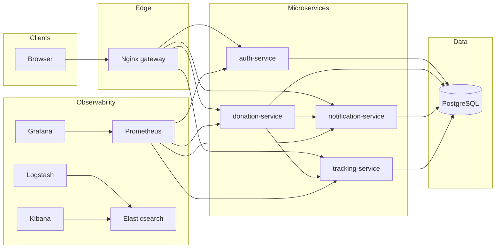

# FoodBridge architecture

## Logical view

## Service boundaries

- **Authentication** owns users, password hashes, JWT issuance, and admin user listing.
- **Donations** owns listings, pickup lifecycle (`open` → `accepted` → `completed` / `expired`), and file storage for photos.
- **Notifications** owns per-user notification rows; internal HTTP is used from donation flows.
- **Tracking** owns pickup sessions and geo points; internal HTTP creates a session when an NGO accepts a donation.

## Networking (Docker)

All containers attach to the **bridge** network `foodbridge`. Services resolve each other by **DNS name** (Compose service names). Only **Nginx** and observability UIs expose host ports by default.
